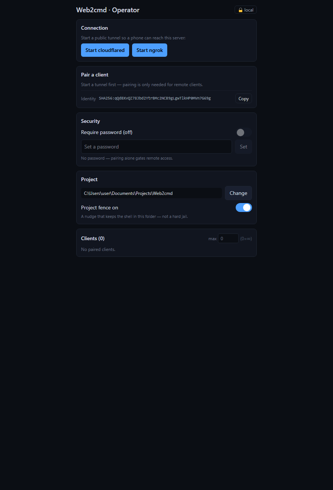

# Web2cmd

A mobile-first **web terminal + file editor** that drives a shell — including **Claude Code** —
running on *your own laptop*. Open it on your phone, pick a project folder, start Claude, and
answer its confirmation prompts from anywhere. The same live session is shared between your
laptop and your phone simultaneously.

Built for one specific pain: Claude pauses for a confirmation while you're away from the
laptop, and the work stalls. With Web2cmd you confirm from your phone and keep moving.

## Screenshots

| Operator Console (on the laptop) | Driving Claude from a phone |
| :---: | :---: |
|  |  |

<!-- Drop two images here: docs/screenshot-console.png (the localhost Operator Console) and
     docs/screenshot-client.png (a phone running the client / driving Claude). They render above. -->

## What you get

- 📱 **Drive Claude Code from your phone** — answer its confirmation prompts from anywhere.
- 🖥️ **One-click server** — a single `web2cmd.exe`; double-click and the Operator Console opens.
- 🔗 **Pair once** — short code + pinned server identity; the tunnel URL can change freely.
- 👥 **Multiple clients, one shared shell** — with a single-typist lock so nobody clobbers anyone.
- 🔔 **Push notifications** the moment Claude is waiting — even with the screen locked.
- 🧰 **Operator console** to start/stop the tunnel, pick the project, cap & revoke clients.

> ⚠️ **Read this first.** Web2cmd hands whoever can reach it **command execution on your laptop,
> as your user**. Run unauthenticated **only on localhost/LAN**. The moment you expose it
> (a tunnel), a device must **pair** before it can connect, and your client **pins the server's
> identity**. The project fence keeps *normal* use inside the chosen folder but is **not a jail** —
> see [Threat model](#threat-model). Don't expose Web2cmd to anyone you wouldn't hand a terminal.

---

## How it works

```
 phone browser ─┐
                ├─(WSS over tunnel)─► Web2cmd server (your laptop) ─► pwsh PTY ─► claude
 laptop browser ┘                         │
                                          └─ one shared shell per project
```

- **One shared shell per project.** Every client (phone, laptop browser) attaches to the *same*
  PTY: output is broadcast to all, and either side can run the next command and continue.
- **Broadcast on submit, not keystrokes.** At the shell prompt your typing stays local and is
  sent only when you press Enter, so another viewer never sees your half-typed line — they see
  committed commands and their output. Inside full-screen TUIs (Claude's menus, vim) input is
  raw so arrow keys etc. work. A `⌨ line/raw` toggle in the terminal overrides the mode.
- **Durable per-project history.** A session's scrollback is persisted per project, so a new
  client replays the current screen — and it survives a full server restart.
- The PTY **survives client disconnects** and is sized to the **smallest** attached client.

---

## Quick start (local)

Requirements: Node ≥ 20, `pnpm`, `pwsh`, and (for driving Claude) the `claude` CLI on `PATH`.
For tunnels, `cloudflared` and/or `ngrok`.

```powershell
pnpm install
pnpm build          # build web app + server

.\start.ps1         # http://localhost:8787 — runs OPEN on localhost/LAN (no password)
```

**Auth is optional and off by default.** On localhost/LAN that's fine. Open the URL, pick a
folder, choose **Start Claude** / **Resume Claude** / **Shell only**, and go. The bottom toolbar
provides keys phones lack (Esc, Tab, arrows, Ctrl combos, Paste).

## Remote access (phone over a tunnel)

```powershell
.\start.ps1 -Tunnel cloudflare    # prints a https://<random>.trycloudflare.com URL
# or
.\start.ps1 -Tunnel ngrok
```

**Stopping:** if you started it in a terminal, press **Ctrl+C** there (it cleans up the server +
tunnel). If it's running in the background, run `.\stop.ps1` (stops the server on port 8787 and any
cloudflared/ngrok tunnel).

When exposed remotely, Web2cmd **requires pairing** — an open terminal is never served over a
tunnel:

1. The server console prints a **6-digit pairing code** (valid ~30 min). The Operator Console has a
   **New code** button, or press Enter in the server window, for a fresh one.
2. Open the tunnel URL on your phone → enter the code on the **Pair this device** screen.
3. The phone receives a long-lived **device token** and **pins the server's identity
   fingerprint** (shown on the pairing screen — confirm it matches the `identity:` line in the
   server console). Because the client trusts the *identity*, not the URL, a tunnel handing out a
   fresh URL on each restart no longer matters — and if the server's identity ever changes, the
   client hard-stops and makes you re-pair.

### Auth modes

| Mode | How to enable | Behaviour |
| ---- | ------------- | --------- |
| **off** (default) | `WEB2CMD_AUTH=off` | Open on localhost/LAN. Remote still requires pairing. |
| **password** | `WEB2CMD_AUTH=password` + set a password | Every request needs a token. Pairing **also** asks for the password, so a device token always implies the password was known. |

```powershell
# optional shared password (stored only as a bcrypt hash in .web2cmd/config.json)
pnpm --filter @web2cmd/server set-password -- "<your-strong-password>"
```

If a password already exists, auth defaults to `password` (so existing setups keep gating).

## Host the client yourself (GitHub Pages)

The web client is a **generic, static app** — it doesn't have to be served by your server. You can
host it once at a stable URL (e.g. GitHub Pages) and point it at *any* Web2cmd server:

- Install the PWA **once** from the stable `github.io` URL instead of re-adding the ephemeral
  `trycloudflare` URL every time the tunnel restarts.
- Anyone can run **their own** server and use the same hosted app pointed at **their own** tunnel —
  nobody depends on a single tunnel for the app itself.

On first load the app asks for your **server URL** (your tunnel or LAN address); it stores it and
you pair once. Because the client trusts the server's pinned **identity**, not the URL, you just
update the URL (☰ → Server → *Change server URL*) when the tunnel changes — your pairing and
identity pin carry over.

> The static client still needs to *reach* your laptop's server, so a tunnel/LAN is required for
> the connection — Pages only removes the dependency on a tunnel to **deliver the app**.

**Deploy:** the repo ships `.github/workflows/pages.yml`. In your fork: **Settings → Pages → Source
= GitHub Actions**, then push to `main`. The app builds with `base=/<repo>/` and deploys to
`https://<you>.github.io/<repo>/`. The server it talks to must allow the Pages origin for CORS —
that's automatic (origins are reflected), or restrict it with `WEB2CMD_ALLOW_ORIGIN`.

To build the hosted client locally: `WEB2CMD_BASE=/<repo>/ pnpm --filter @web2cmd/web build`.

## Single .exe (one-click)

Web2cmd ships as one self-contained Windows executable (Node SEA — bundles the server, the web
build, and node-pty; the native files self-extract to `%LOCALAPPDATA%\Web2cmd` on first run).
**Double-click it and the Operator Console opens in your browser** — pick a project folder, start a
tunnel, and share the URL + pairing code. No terminal, no scripts.

- **Download:** grab `web2cmd.exe` from the repo's [Releases](../../releases).
- **Build it yourself:**
  ```powershell
  pnpm build:exe        # → build\exe\web2cmd.exe   (needs network once, for `postject`)
  .\build\exe\web2cmd.exe
  ```
- **Cut a release:** push a tag (`git tag v0.2.0 && git push --tags`) — `.github/workflows/release.yml`
  builds the `.exe` on a Windows runner and attaches it to the GitHub Release.

Currently produces a **win32-x64** binary. Releases are **code-signed via SignPath** (free for
open source) when configured — see [docs/SIGNING.md](docs/SIGNING.md); until then they ship
unsigned (Windows will warn about an unknown publisher).

---

## Operator Console

Open the server on **localhost** (`http://localhost:8787`, or just run the `.exe`) and you get the
**Operator Console** instead of a terminal — the admin surface, served only to the person at the
machine (anything arriving through the tunnel is always treated as a client). From it you can:

- **Start/Stop a tunnel** — it detects installed tools (cloudflared/ngrok) or guides you to install one.
- **Pick the project root** and toggle the **project fence**.
- See the live **URL + pairing code** (with a **New code** button) and the server **identity** to read out.
- **Manage clients** — see who's connected, set a **max** (channels), and **revoke** any device instantly.
- Optionally set a **password** and require it on top of pairing.
- **Release control** of a session's typing lock to hand the keyboard to another client.

## Push notifications ("Claude is waiting")

Get pinged on your phone the moment Claude pauses for a confirmation, even with the screen locked.

1. Open the app over **HTTPS** (the tunnel URL — Web Push requires a secure context).
2. **Android:** menu (☰) → **Notifications → Enable**, accept the prompt, hit **Test**.
3. **iPhone (iOS 16.4+):** **Add to Home Screen** from Safari's share sheet, open from the
   home-screen icon, then Enable notifications.

The server watches each session's output and, when it goes idle on what looks like a confirmation
prompt, sends an encrypted Web Push with a snippet. Tapping it opens the app focused on that
session. Detection patterns live in `server/src/sessions.ts` (`PROMPT_PATTERNS`).

## Project fence

To keep work inside the chosen folder, Web2cmd guards three surfaces:

- **File browser / editor (FS API)** — hard-scoped to the project root; the client cannot read or
  write outside it.
- **Claude's tool calls** — an opt-in PreToolUse hook (☰ → 🚧 Project fence → *Protect Claude in
  this project*) blocks Claude file edits / `cd` outside the root.
- **The shell** — `cd`/`Set-Location`/`pushd` out of the root are blocked; approve an exception
  **once** or **always** from the app (☰ → 🚧 Project fence).

Disable with `WEB2CMD_FENCE=off`. **Important:** the shell guard is a convenience nudge, not a
security boundary — see below.

## Threat model

Be honest about what does and doesn't contain a user. Web2cmd runs a shell **as your OS user,
with your privileges, and no OS-level sandbox** (a deliberate choice). The layers, by real strength:

| Layer | Protects | Strength |
| ----- | -------- | -------- |
| **Access** — OTP **pairing** for remote (operator-gated: clients are registered, **revocable**, and **capped**), optional **password**, + **server-identity pinning** | who can connect at all | **This is the real perimeter.** Treat the pairing code + password like keys. The operator can revoke any client instantly. |
| **Typing lock** — single active typist per session | two clients clobbering one shell | **Enforced** — the server only writes the lock-holder's input to the PTY; others are read-only until the holder releases or the operator hands control over. |
| **FS API fence** (`resolveInRoot`) | the web file browser/editor staying in the project root | **Hard** — the client genuinely cannot escape the root. |
| **Claude PreToolUse hook** | Claude's structured file tools + `cd` staying in root | **Medium** — covers normal tool use; does not parse arbitrary shell redirection. |
| **Shell `cd` guard** | accidental drift out of the project in the interactive shell | **Nudge only.** |

The **Operator Console** (admin controls — start/stop tunnel, set root, fence, password/auth, revoke clients) is only served to **localhost** (the person at the machine); requests arriving through the tunnel are always treated as untrusted clients.

**The shell `cd` guard is not a boundary.** It only overrides the `cd`/`Set-Location`/`pushd`
aliases. A user can trivially escape it — calling the cmdlet by its module-qualified name,
deleting the override function, or simply **reading/writing files outside the root with no `cd` at
all** (file cmdlets aren't guarded). This was verified by adversarial testing. Anyone with shell
access is **not contained**.

**Bottom line:** the security boundary is *who you let connect* (keep it local, or require
pairing + a password for remote), **not** the in-shell fence. Don't expose Web2cmd to people you
wouldn't hand a terminal on your laptop. For defence in depth on a public tunnel, put an access
proxy (e.g. Cloudflare Access) in front of it.

---

## Configuration (env vars)

| Var                   | Default                 | Purpose                                                    |
| --------------------- | ----------------------- | ---------------------------------------------------------- |
| `WEB2CMD_AUTH`        | `off` (or `password` if a password exists) | access mode: `off` \| `password`         |
| `WEB2CMD_EXPOSURE`    | `local`                 | `local` (localhost/LAN) or `remote` (tunnelled ⇒ pairing required); set by `start.ps1` |
| `WEB2CMD_FENCE`       | `on`                    | project fence: `on` \| `off`                               |
| `WEB2CMD_HOST`        | `0.0.0.0`               | bind address                                               |
| `WEB2CMD_PORT`        | `8787`                  | port                                                       |
| `WEB2CMD_PASSWORD`    | —                       | set/rotate the password on boot (optional)                 |
| `WEB2CMD_ALLOW_ORIGIN`| — (reflect any)         | CORS allowlist (comma-separated) when the client is hosted on another origin |
| `WEB2CMD_DATA_DIR`    | `<repo>/.web2cmd`       | hashed password, token secret, server identity, fence allowlist |
| `WEB2CMD_TOKEN_TTL`   | `30d`                   | password-login (session) token lifetime                    |
| `WEB2CMD_DEVICE_TTL`  | `365d`                  | paired-device token lifetime                               |
| `WEB2CMD_DEFAULT_CWD` | repo root               | folder the project picker opens at                         |
| `WEB2CMD_NO_OPEN`     | —                       | set to `1` to stop the `.exe` auto-opening the browser     |

Most of these (auth/password, fence, tunnel, project root, device cap) can also be changed at
runtime from the **Operator Console** (open `http://localhost:8787` on the server machine).

## Development

```powershell
pnpm dev:server   # API + PTY server with reload
pnpm dev:web      # Vite dev server (proxies /api and /ws to :8787); open http://localhost:5173
```

## Project layout

```
server/src/
  index.ts        Fastify API + WebSocket PTY bridge + auth gate + fence/pairing endpoints
  config.ts       runtime config + persisted secrets (auth mode, exposure, fence)
  auth.ts         session/device tokens + checkAccess (the access model)
  identity.ts     server ed25519 keypair + fingerprint (pinned by clients)
  pairing.ts      short-lived OTP → long-lived device token
  fence.ts        project fence: path checks, allowlist, the PowerShell guard script
  history.ts      durable per-project scrollback
  sessions.ts     shared PTY sessions + "waiting" detection
  push.ts         Web Push (VAPID, subscriptions, delivery)
  sea-bootstrap.ts / sea-entry.ts   single-.exe self-extraction + entry
web/              Vite + React + Tailwind (xterm.js terminal, CodeMirror editor, PWA)
  src/lib/lineEditor.ts             client line editor (broadcast-on-submit)
  src/lib/api.ts                    REST/WS client + server-base URL (same-origin or hosted)
  src/components/{Pairing,IdentityChanged,ServerUrl,Terminal,...}.tsx
.github/workflows/pages.yml         build + deploy the client to GitHub Pages
scripts/
  build-exe.mjs   package the server as a single Windows .exe (Node SEA)
  fence-hook.mjs  Claude PreToolUse fence hook
attach/attach.mjs native terminal client for the shared session (password/token mode)
start.ps1         launcher (server + optional tunnel; sets exposure + prints pairing code)
```

### Advanced: attach a native laptop terminal

A native PowerShell window the server spawns is invisible to other clients. To mirror the shared
session in a real terminal instead (works in `password` mode, or pass an existing `--token`):

```powershell
node attach\attach.mjs --pass "<password>" --list     # list live sessions
node attach\attach.mjs --pass "<password>"            # attach most recent / create in cwd
node attach\attach.mjs --pass "<password>" --cwd C:\path\to\project --claude
```

Detach with **Ctrl+]** (the session keeps running on the server).

## License

[MIT](./LICENSE).
